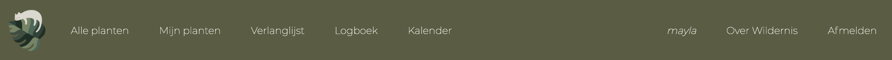

# Design Document

## Features

The main features of the webapplication are:

* Register for an account
* Log in/sign out
* Import data to database (in admin)
* Search for a plant in the database
* Add/remove plant to/from account
* Add/remove plant to/from wishlist
* Logbook for process of the plants
* Calendar with events for watering the plants

In the next section these functionalities be described in more detail by going through the different pages of the webapplication. The functionalities have been marked **bold** and the buttons *italic*.

## User interface

#### Workflow
</img>

The workflow above shows the main navigation through the URLs of Wildernis. Not every path is included, because the user can for example log out of from anywhere and go back to the index page. You can see that the "personal index" (index.html) is the heart of everything of the application.

#### Index page
</img>

The index.html page welcomes users to Wildernis and gives them the possiblity to either **log in** or **register for an account**. If they write down their information and can click the *Aanmelden* button they will be directed to the signed-in version of index.html (explained below). Clicking on the text *Account aanmaken* will direct the user to the following register page:

#### Register page

If the user wants to **register for an account** they can do so on this register.html: write down information and click *Registreren*. If on a second thought the user remembers they already have an account, they can go back by clicking *Log in*. 

#### Navigation bar

Above a screenshot from the navigation bar is shown. 
* Clicking on *Alle planten* redirects the user to plants.html where **all plants in the database** are listed.
* *Mijn planten* redirects the user to their **personal plants**.
* *Verlanglijst* redirects to wishlist.html the plants added to their **personal wishlist**.
* *Logboek* renders progress.html to the pictures the user has uploaded for **the process of their plants**.
* *Kalender* redirects to calendar.html with their **personal calendar**.
* *Over Wildernis* to about.html.
* If the user clicks *Afmelden"* he will be **signed out** and redirected to index.html. 
* The text *mayla* will show the user's name (so probably not mayla) or...
* The logo to the left, will always return the user to this page:

#### Personal index page
</img>

This page is the signed-in version of *index.html*. From here the user has multiple options. They are very similar to the navigation bar. The user can either click the text or the illustration above it.

#### Admin integrated database
</img>

What is a plant site without any plants? **Importing a database** to the application has been made pretty simple, thanks to Django's [import-export](https://django-import-export.readthedocs.io/en/latest/) module. If the superuser logs in to Django admin they can add data by clicking *"import"* (or export) next to *Add*. If all goes well, it looks like as seen in the example above.

#### All plants page
</img>

This is plants.html where all the plants (from admin) can be found. The user can **search for plants** by writing a name, or even just some of the letters of the name, of a plant clicking *zoeken* the user will be redirected to the results.html".

#### Plant page 1/2
</img>

Clicking on the plant name redirects the user to the specific plant page. (plant.html, singular) Users have the option to **add this plant to their wishlist** by clicking *toevoegen aan verlanglijst* or to **their own plant collection** with *toevoegen aan mijn planten*. In the case the user has already added the plant to their account (as in the screenshot above) the user can also click the top-right button to go directly to this plant in their personal account.

#### User plants page
</img>

The content of this page, user_plants.html, depends on the user. Above example shows plants connected to 'mayla'. If no plants have been added yet the page will be empty and encourage the user to add some. By clicking on the name of the plant or the picture you can to the details of the plants:

#### User plant page 2/2
</img>

This is the page, user_plant.html (singular), for a houseplant in the user's plants. The difference with the plant.html is that here, if any, progress photos are shown plus more in-depth information. The user can also remove the plant from their collection or go to the progress page. If they click on *Voeg foto toe* they will be redirected to:

#### Add progress
</img>

Adding new pictures of their plants can be done here. The result can be found on either the specific user_plant.html before or:

#### Progress page
</img>

Here! This is progress.html and from here it's also possible to **add progress** of the growth of your plants.

#### Calendar page
</img>

This page will show a calender with the most optimal watering days for their plants. It is calculated by the infromation on the frequency of water required given in the database. The plants are automaticaly added, based on the user, and the user can browse through the months.

#### Wishlist page
</img>

Here the plants added to the user's wishlist are shown. This user has no items yet, and is encouraged to add some by clicking "Alle planten". If there are plants in this list, the user can also delete them with a button.

Last but not least below a model is shown how the models relate to each other:

##### Database
</img>

The database model above shows a not too complicated relation structure. Obviously *Plant* is the most imported model, it has a connection to or from every other model. With Django's AbstractUser automatically creates User objects, the *User* fields above are the additional fields the database is Dutch until image, this is because these fields are also shown in the front-end of the website. This is also the case for progress.